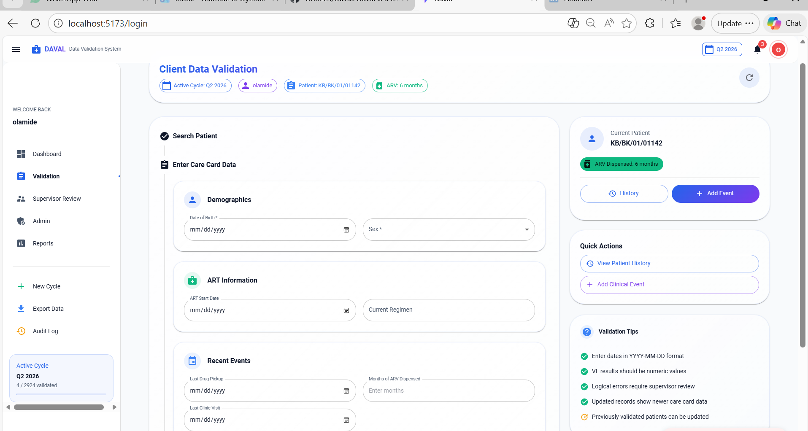
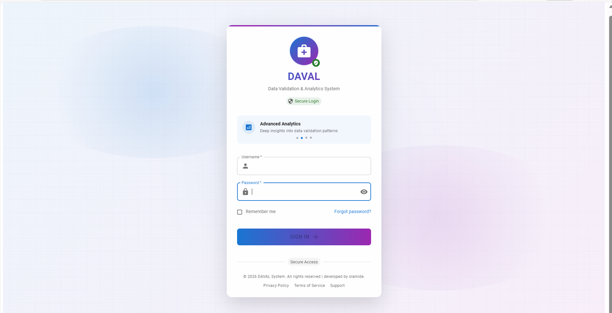
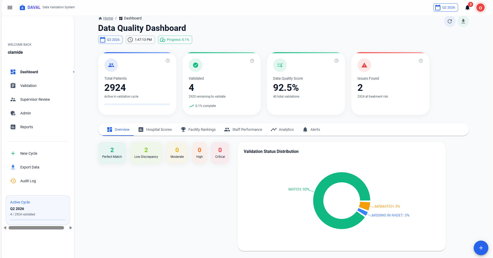

# 🏥 DAVAL — Data Validation & Analytics System




## 📌 Overview

**DAVAL (Data Validation & Analytics System)** is a comprehensive healthcare data validation platform designed to ensure the **accuracy, consistency, and integrity of HIV patient records** across healthcare facilities.

The system bridges the gap between:

* 🗄️ **Electronic Medical Records (RADET)**
* 📄 **Physical Patient Care Cards**

By enabling structured validation workflows, DAVAL supports data quality assurance, clinical accuracy, and informed decision-making.

---

## 🚀 Core Functionality

DAVAL operates through **validation cycles**, where healthcare staff:

1. 🔍 Search patients using hospital numbers
2. 📝 Enter care card data manually
3. ⚖️ Compare with RADET records
4. 📊 Receive instant validation results

### Validation Results Include:

* ✅ Match
* ⚠️ Mismatch
* ❌ Missing in RADET
* 🚨 Logical Errors

---

## ✨ Key Features

### 🔐 Role-Based Access Control

* 👤 **Staff** – Data entry & validation
* 👨‍⚕️ **Supervisor** – Review & approval
* ⚙️ **Admin** – Full system control

---

### 🔄 Validation Cycles

* Organized validation campaigns
* Real-time progress tracking
* Performance monitoring

---

### 🧠 Logical Error Detection

* Date inconsistencies
* Age vs regimen validation
* Clinical logic checks

---

### 🔁 Correction Workflow

* Staff request corrections
* Supervisor approval system
* Full audit trail tracking

---

### 📊 Advanced Analytics Dashboard

* Data Quality Index (DQI)
* Staff performance metrics
* Validation trends
* Treatment interruption risks

---

### 📅 Event Tracking

* Drug pickup history
* Clinical visits
* Viral load monitoring

---

### 📤 Data Export

Export reports in:

* JSON
* CSV
* PDF

---

## 🧱 Technical Architecture

### 🔙 Backend

* ⚡ FastAPI
* 🗄️ SQLite / PostgreSQL
* 🔐 Token-based Authentication
* RESTful API

---

### 🎨 Frontend

* ⚛️ React (TypeScript)
* 🎯 Material UI (MUI v5+)
* 📊 Recharts for visualization

---

### 🧩 System Design

* Modular architecture
* Scalable components
* Clean API integration

---

## 📈 Impact

DAVAL enhances healthcare data systems by:

* ✅ Improving **data accuracy**
* 📊 Enabling **real-time monitoring**
* 🚨 Detecting **treatment risks early**
* 📉 Reducing **data entry errors**
* 🏥 Supporting **evidence-based decisions**

---

## 🖥️ Screenshots

### 🔐 Login Interface



### 📊 Dashboard



### 📝 Validation Module


---

## ⚙️ Installation

```bash
# Clone repository
git clone https://github.com/Orlitech/Daval.git

# Navigate into project
cd Daval

# Install frontend dependencies
npm install

# Start frontend
npm run dev
```

---

## 🔗 API Setup (Backend)

```bash
# Navigate to backend
cd backend

# Install dependencies
pip install -r requirements.txt

# Run server
uvicorn server:app --reload
```

---

## 📌 Future Improvements

* 🔔 Notification system
* ☁️ Cloud deployment
* 📱 Mobile responsiveness
* 🤖 AI-powered anomaly detection

---

## 👨‍💻 Author

**Olamide Benjamin**
📊 Data Analyst | 💻 Full Stack Developer

---

## 📜 License

MIT License
